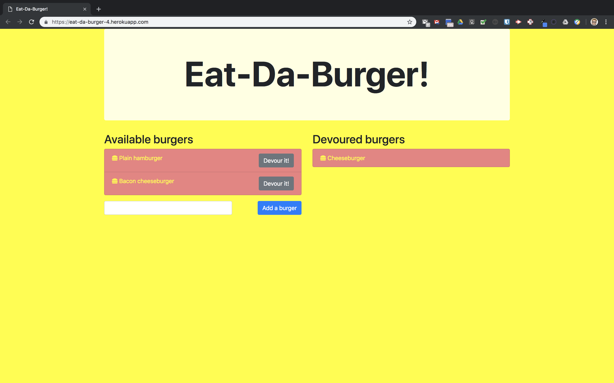

# burger: The Eat-Da-Burger! restaurant app

[Eat-Da-Burger!](https://eat-da-burger-4.herokuapp.com/) is a restaurant app
that lets users input the names of burgers they'd like to eat. Whenever a user
submits a burger's name, the app displays the burger on the left side of the
page -- waiting to be devoured.  Each burger in the waiting area also has a
`Devour it!` button. When the user clicks it, the burger moves to the right
side of the page.



The application demonstrates MySQL, Node, Express, Handlebars and a homemade
ORM (object-relational mapper).  It follows the MVC (model-view-controller)
design pattern, using Node and MySQL to query and route data, and Handlebars
to generate the HTML.

To run your own local copy of the application, you must first set up a local
copy of MySQL on port 3306. Use the `db/schema.sql` and `db/seeds.sql` files
to create and populate a database called `burgers_db`. Then place an `.env`
file in the root directory of the app with your MySQL username and password,
formatted like so:

```
MYSQL_USER=<username>
MYSQL_PASSWORD=<password>
```

Run `npm install` in the application root directory to install all
dependencies, and then `npm start` to start the application.

## Libraries used

* [Bootstrap](https://getbootstrap.com/)
* [dotenv](https://github.com/motdotla/dotenv#readme)
* [Express](https://expressjs.com/)
* [Font Awesome](https://fontawesome.com/)
* [Handlebars](http://handlebarsjs.com/) and [Express Handlebars](https://github.com/ericf/express-handlebars)
* [jQuery](https://jquery.com/)
* [mysql](https://github.com/mysqljs/mysql#readme)
